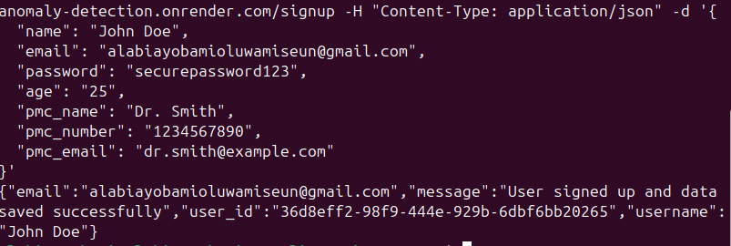

 
# Backend API Documentation

This document outlines the available API routes, their purposes, required parameters, and expected responses. The backend is built using Flask and interacts with a Supabase database to manage user data, biometric data, alerts, and more.

## Base URL
The base URL for all API endpoints is:  
`https://cavista-anomaly-detection.onrender.com`


---

## 1. **User Authentication**

### **Sign Up**
- **Endpoint:** `/signup`
- **Method:** `POST`
- **Description:** Registers a new user in the system.
- **Request Body (JSON):**
  ```json
  {
    "name": "John Doe",
    "email": "john.doe@example.com",
    "password": "securepassword123",
    "pmc_name": "Dr. Smith",
    "pmc_number": "1234567890",
    "pmc_email": "dr.smith@example.com"
  }
  ```
- **Response:**
  - **Success (201):**
    ```json
    {
      "message": "User signed up and data saved successfully",
      "user_id": "unique_user_id",
      "username": "John Doe",
      "email": "john.doe@example.com"
    }
    ```
  - **Error (400 or 500):**
    ```json
    {
      "error": "Error message"
    }
    ```

curl -X POST https://cavista-anomaly-detection.onrender.com/signup \
 -H "Content-Type: application/json" \
-d '{
  "name": "John Doe",
  "email": "john.doe@example.com",
  "password": "securepassword123",
  "age": "25",
  "pmc_name": "Dr. Smith",
  "pmc_number": "1234567890",
  "pmc_email": "dr.smith@example.com"
}'
---

### **Sign In**
- **Endpoint:** `/signin`
- **Method:** `POST`
- **Description:** Authenticates a user and logs them into the system.
- **Request Body (JSON):**
  ```json
  {
    "email": "john.doe@example.com",
    "password": "securepassword123"
  }
  ```
- **Response:**
  - **Success (200):**
    ```json
    {
      "message": "User logged in successfully",
      "user_id": "unique_user_id",
      "username": "John Doe",
      "email": "john.doe@example.com"
    }
    ```
  - **Error (400 or 500):**
    ```json
    {
      "error": "Invalid email or password"
    }
    ```

---

## 2. **Biometric Data**

### **Record Biometric Data**
- **Endpoint:** `/record_bio_data`
- **Method:** `POST`
- **Description:** Records heart rate (BPM) and step count data for a user.
- **Request Body (JSON):**
  ```json
  {
    "userID": "unique_user_id",
    "bpm_list": [72, 75, 78],
    "step_list": [100, 150, 200]
  }
  ```
- **Response:**
  - **Success (200):**
    ```json
    {
      "message": "Biometric data recorded successfully"
    }
    ```
  - **Error (400 or 500):**
    ```json
    {
      "error": "Failed to record biometric data"
    }
    ```

---

### **Get All BPM Data**
- **Endpoint:** `/get_all_bpm`
- **Method:** `POST`
- **Description:** Retrieves all recorded heart rate (BPM) data for a user.
- **Request Body (JSON):**
  ```json
  {
    "userID": "unique_user_id"
  }
  ```
- **Response:**
  - **Success (200):**
    ```json
    {
      "bpm": [72, 75, 78, ...]
    }
    ```
  - **Error (400 or 500):**
    ```json
    {
      "error": "No BPM data available"
    }
    ```

---

### **Get Last 10 BPM Readings**
- **Endpoint:** `/get_beats_10`
- **Method:** `POST`
- **Description:** Retrieves the last 10 heart rate (BPM) readings for a user.
- **Request Body (JSON):**
  ```json
  {
    "userID": "unique_user_id"
  }
  ```
- **Response:**
  - **Success (200):**

```json
    {
  "bpm": [
    {
      "bpm": 72,
      "time": "2025-02-22T21:45:46.896020"
    },
    {
      "bpm": 75,
      "time": "2025-02-22T21:45:46.896034"
    },
    {
      "bpm": 73,
      "time": "2025-02-22T21:45:46.896039"
    },
    {
      "bpm": 78,
      "time": "2025-02-22T21:45:46.896042"
    },
    {
      "bpm": 80,
      "time": "2025-02-22T21:45:46.896046"
    },
    {
      "bpm": 82,
      "time": "2025-02-22T21:45:46.896049"
    },
    {
      "bpm": 79,
      "time": "2025-02-22T21:45:46.896053"
    },
    {
      "bpm": 77,
      "time": "2025-02-22T21:45:46.896056"
    },
    {
      "bpm": 76,
      "time": "2025-02-22T21:45:46.896060"
    },
    {
      "bpm": 75,
      "time": "2025-02-22T21:45:46.896063"
    },
    {
      "bpm": 74,
      "time": "2025-02-22T21:45:46.896066"
    },
    {
      "bpm": 73,
      "time": "2025-02-22T21:45:46.896070"
    },
    {
      "bpm": 72,
      "time": "2025-02-22T21:54:19.822282"
    },
    {
      "bpm": 75,
      "time": "2025-02-22T21:54:19.822319"
    },
    {
      "bpm": 73,
      "time": "2025-02-22T21:54:19.822327"
    },
    {
      "bpm": 78,
      "time": "2025-02-22T21:54:19.822334"
    },
    {
      "bpm": 80,
      "time": "2025-02-22T21:54:19.822342"
    },
    {
      "bpm": 82,
      "time": "2025-02-22T21:54:19.822351"
    },
    {
      "bpm": 79,
      "time": "2025-02-22T21:54:19.822356"
    },
    {
      "bpm": 77,
      "time": "2025-02-22T21:54:19.822363"
    },
    {
      "bpm": 76,
      "time": "2025-02-22T21:54:19.822369"
    },
    {
      "bpm": 75,
      "time": "2025-02-22T21:54:19.822377"
    },
    {
      "bpm": 74,
      "time": "2025-02-22T21:54:19.822383"
    },
    {
      "bpm": 73,
      "time": "2025-02-22T21:54:19.822391"
    },
    {
      "bpm": 72,
      "time": "2025-02-22T21:58:42.083911"
    },
    {
      "bpm": 75,
      "time": "2025-02-22T21:59:42.083911"
    },
    {
      "bpm": 73,
      "time": "2025-02-22T22:00:42.083911"
    },
    {
      "bpm": 78,
      "time": "2025-02-22T22:01:42.083911"
    },
    {
      "bpm": 80,
      "time": "2025-02-22T22:02:42.083911"
    },
    {
      "bpm": 82,
      "time": "2025-02-22T22:03:42.083911"
    },
    {
      "bpm": 79,
      "time": "2025-02-22T22:04:42.083911"
    },
    {
      "bpm": 77,
      "time": "2025-02-22T22:05:42.083911"
    },
    {
      "bpm": 76,
      "time": "2025-02-22T22:06:42.083911"
    },
    {
      "bpm": 75,
      "time": "2025-02-22T22:07:42.083911"
    },
    {
      "bpm": 74,
      "time": "2025-02-22T22:08:42.083911"
    },
    {
      "bpm": 73,
      "time": "2025-02-22T22:09:42.083911"
    }
  ]
    }
    ```

  - **Error (400 or 500):**
    ```json
    {
      "error": "No BPM data available"
    }
    ```

    
---

### **Get Steps Per Minute**
- **Endpoint:** `/get_step_data`
- **Method:** `POST`
- **Description:** Calculates the average steps per minute for a user based on their last 10 recorded steps.
- **Request Body (JSON):**
  ```json
  {
    "userID": "unique_user_id"
  }
  ```
- **Response:**
  - **Success (200):**
    ```json
    {
      "average_steps_per_minute": 120
    }
    ```
  - **Error (400 or 500):**
    ```json
    {
      "error": "No step data available"
    }
    ```

---

## 3. **Alerts**

### **Create Alert**
- **Endpoint:** `/create_alert`
- **Method:** `POST`
- **Description:** Creates an alert for a user when an anomaly is detected (e.g., abnormal heart rate).
- **Request Body (JSON):**
  ```json
  {
    "userID": "unique_user_id",
    "bpm": 120
  }
  ```
- **Response:**
  - **Success (200):**
    ```json
    {
      "message": "Alert created successfully"
    }
    ```
  - **Error (500):**
    ```json
    {
      "error": "Failed to create alert"
    }
    ```

---

### **Get Alerts**
- **Endpoint:** `/get_alerts`
- **Method:** `GET`
- **Description:** Retrieves all alerts for a specific user.
- **Request Body (JSON):**
  ```json
  {
    "userID": "unique_user_id"
  }
  ```
- **Response:**
  - **Success (200):**
    ```json
    {
      "alerts": [
        {
          "id": 1,
          "userID": "unique_user_id",
          "bpm": 120,
          "time": "2023-10-01T12:00:00Z"
        },
        ...
      ]
    }
    ```
  - **Error (400 or 500):**
    ```json
    {
      "error": "No alerts found for this user"
    }
    ```

---

## 4. **Primary Healthcare Provider (PMC) Updates**

### **Update PMC 1**
- **Endpoint:** `/update_pmc_1`
- **Method:** `POST`
- **Description:** Updates the primary healthcare provider (PMC 1) information for a user.
- **Request Body (JSON):**
  ```json
  {
    "userID": "unique_user_id",
    "pmc_name": "Dr. Smith",
    "pmc_email": "dr.smith@example.com",
    "pmc_number": "1234567890"
  }
  ```
- **Response:**
  - **Success (200):**
    ```json
    {
      "message": "Updated successfully"
    }
    ```
  - **Error (500):**
    ```json
    {
      "error": "Failed to update PMC 1 data"
    }
    ```

---

### **Update PMC 2**
- **Endpoint:** `/update_pmc_2`
- **Method:** `POST`
- **Description:** Updates the secondary healthcare provider (PMC 2) information for a user.
- **Request Body (JSON):**
  ```json
  {
    "userID": "unique_user_id",
    "pmc_name": "Dr. Johnson",
    "pmc_email": "dr.johnson@example.com",
    "pmc_number": "0987654321"
  }
  ```
- **Response:**
  - **Success (200):**
    ```json
    {
      "message": "Updated successfully"
    }
    ```
  - **Error (500):**
    ```json
    {
      "error": "Failed to update PMC 2 data"
    }
    ```

---

### **Insert PMC 2**
- **Endpoint:** `/insert_pmc_2`
- **Method:** `POST`
- **Description:** Inserts a new secondary healthcare provider (PMC 2) for a user.
- **Request Body (JSON):**
  ```json
  {
    "userID": "unique_user_id",
    "pmc_name": "Dr. Johnson",
    "pmc_email": "dr.johnson@example.com",
    "pmc_number": "0987654321"
  }
  ```
- **Response:**
  - **Success (200):**
    ```json
    {
      "message": "Inserted successfully"
    }
    ```
  - **Error (500):**
    ```json
    {
      "error": "Failed to insert PMC 2 data"
    }
    ```

---

## Error Handling

All endpoints return appropriate HTTP status codes:
- **200 (OK):** Successful operation.
- **400 (Bad Request):** Missing or invalid parameters.
- **500 (Internal Server Error):** An unexpected error occurred on the server.

---

## Notes for Frontend Team

1. **Authentication:** Ensure that users are authenticated before accessing protected routes (e.g., recording biometric data, updating PMC information).
2. **Error Handling:** Always handle errors gracefully on the frontend by displaying meaningful messages to the user.
3. **Data Validation:** Validate input data on the frontend before sending requests to the backend to reduce unnecessary API calls.

---

This documentation should provide the frontend team with all the necessary information to integrate with the backend API effectively. If you need further clarification or additional details, feel free to ask!